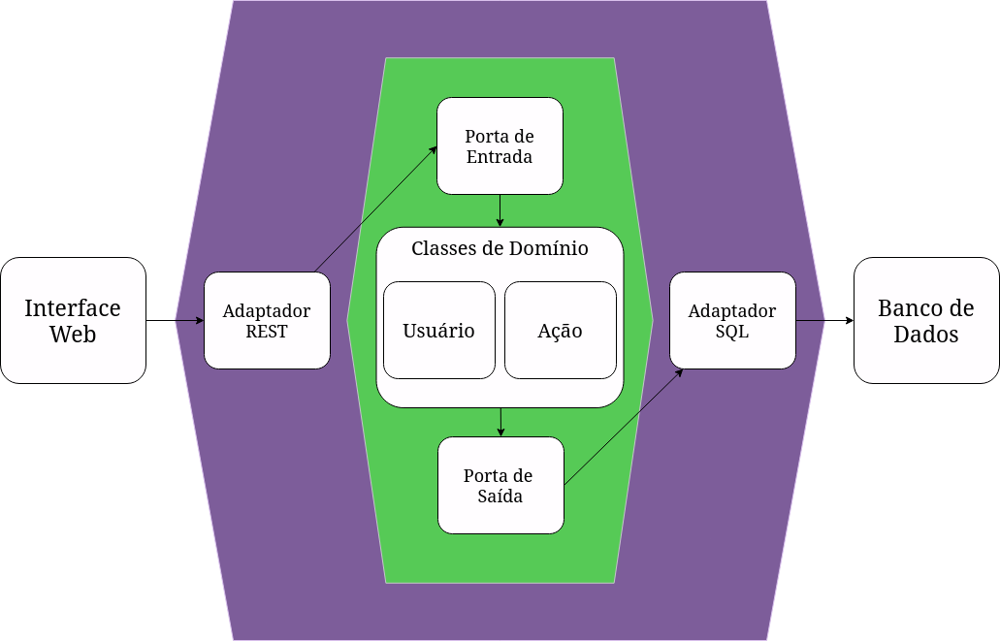

# PDS-Project
Repositório destinado ao desenvolvimento do trabalho prático da disciplina de Prática de Desenvolvimento de Software - UFMG

## Membros
- João Vitor Bicalho da Silva (Front-end)
- João Pedro Reis Teclo de Miranda (Back-end)
- Pedro Renato Ferreira da Silva (Front-end)
- Daniel Barreto Torres (Backend)

## Escopo
Objetivo do Sistema: Corretora de Investimento

Principais features:
- Abertura de conta
- Compra de ativos 
- Consulta à carteira de investimentos
- Simulações de investimentos
- Empréstimos para investimento alavancado

## Tecnologias
Front-end: React, HTML, Sass;

Back-end: Python (Flask), SQLite;

## Backlog do Produto

1. Como usuário, eu gostaria de poder criar uma conta
2. Como usuário, eu gostaria de fazer login no sistema
3. Como usuário eu gostaria de desfazer o login no sistema
4. Como usuário, eu gostaria de editar os meus dados de cadastro
5. Como usuário, eu gostaria de excluir minha conta
6. Como usuário, eu gostaria de listar as opções de investimento
7. Como usuário, eu gostaria de favoritar algumas opções de investimento
8. Como usuário, eu gostaria de poder realizar algum investimento
9. Como usuário, eu gostaria de monitorar (acompanhar) meus investimentos
10. Como usuário, eu gostaria de fazer simulações de investimento
11. Como usuário, eu gostaria de resgatar um investimento feito
12. Como usuário, eu gostaria de adicionar saldo à minha conta
13. Como usuário, eu gostaria de fazer empréstimos para investimento alavancado
14. Como usuário, eu gostaria de consultar o valor histórico de ações
15. Como usuário, eu gostaria de ver a cotação de outras moedas
16. Como usuário, eu gostaria de consultar o valor de criptomoedas
17. Como usuário, eu gostaria de realizar compras de criptomoedas

## Backlog da Sprint (Prevista)

História #1: Como usuário, eu gostaria de poder criar uma conta
  - Tarefas e responsáveis:
    - Instalar banco de dados e criar tabela de cadastro [João Pedro]
    - Criar tela de cadastro [Pedro]
    - Instalar Flask e node.js [João Pedro]
    - Implementar lógica de cadastro no backend [João Pedro]
    - Implementar tela com informações de cadastro do usuário [Pedro]

História #2: Como usuário, eu gostaria de fazer login no sistema
  - Tarefas e responsáveis:
    - Criar tela de login [Pedro]
    - Implementar lógica de login no backend [João Pedro]
    - Integrar a tela de login com a lógica do backend [Pedro]

História #3: Como usuário eu gostaria de desfazer o login no sistema
  - Tarefas e responsáveis:
    - Implementar primeira versão da tela principal do sistema [Pedro]
    - Adicionar botão de logout na tela principal [Pedro]
    - Implementar lógica de logout no backend [João Pedro]
    - Integrar o frontend com a lógica de logout do backend [Pedro]

História #4: Como usuário, eu gostaria de adicionar saldo à minha conta
  - Tarefas e responsáveis:
    - Implementar tela de adicionar saldo [João Vítor]
    - Implementar lógica de adicionar saldo no backend [João Pedro]
    - Integrar a tela de adicionar/ver saldo com a lógica do backend [João Vítor]

História #5:  Como usuário, eu gostaria de editar os meus dados de cadastro
  - Tarefas e responsáveis:
    - Adicionar opção de alterar dados da conta na página de perfil do usuário [Pedro]
    - Fazer funcionalidade no backend que permita a edição dos dados de um usuário no banco de dados [João Pedro]
    - Integrar a tela de edição com a lógica do backend [Pedro]

História #6:  Como usuário, eu gostaria de excluir minha conta
  - Tarefas e responsáveis:
    - Adicionar opção de excluir a conta na página de perfil do usuário [Pedro]
    - Implementar exclusão da conta no banco de dados [João Pedro]
    - Integrar o frontend com a lógica de excluir conta do backend [Pedro]

História #7: Como usuário, eu gostaria de listar as opções de investimento
  - Tarefas e responsáveis:
    - Implementar página de pesquisa e listagem de investimentos [João Vítor]
    - Implementar a funcionalidade que permita o usuário escolher o tipo de investimento que deseja listar (Ações, Renda Fixa, etc.) [João Vítor]
    - Adicionar integração com a API da bolsa de valores [João Vítor]

História #8: Como usuário, eu gostaria de favoritar algumas opções de investimento
  - Tarefas e responsáveis:
    - Adaptar as telas que listam os investimentos para que seja possível clicar em um botão e favoritar um ativo [João Vítor]
    - Implementar tela que liste os investimentos favoritados [João Vítor]
    - Implementar no backend a lógica de armazenar os investimentos favoritos [João Pedro]
    - Integrar a tela de listagem dos favoritos e funcionalidade de favoritar com a lógica do backend [João Vítor]

História #9: Como usuário, eu gostaria de poder realizar algum investimento
  - Tarefas e responsáveis:
    - Adaptar a tela de listagem de investimentos para que seja possível selecionar um e ser redirecionado para uma tela onde seja possível fazer a compra [João Vítor]
    - Implementar uma tela onde seja possível selecionar o valor que desejar investir [Pedro]
    - Implementar a compra de ativos no banco de dados [João Pedro]
    - Integrar o frontend com a lógica de compra de ativos do backend [João Vítor]

História #10: Como usuário, eu gostaria de monitorar (acompanhar) meus investimentos
  - Tarefas e responsáveis:
    - Implementar tela que liste os investimentos já feitos [João Vítor]
    - Implementar lógica de armazenar no banco de dados os investimentos já feitos [João Pedro]
    - Integrar a tela de “meus investimentos” com a lógica do backend [João Vítor]

História #11: Como usuário, eu gostaria de resgatar um investimento feito
  - Tarefas e responsáveis:
    - Adaptar a tela que lista os investimentos já feitos para que seja adicionado uma opção de resgatar o valor [João Vítor]
    - Implementar uma tela onde seja possível realizar a venda do ativo
    - Implementar lógica no backend que permita o resgate de um investimento [João Pedro]
    - Integrar essa funcionalidade do frontend com a lógica do backend [João Vítor]

## Backlog da Sprint (Realizada)

História #1: Como usuário, eu gostaria de poder criar uma conta
  - Tarefas e responsáveis:
    - Instalar banco de dados e criar tabela de cadastro [João Pedro]
    - Criar tela de cadastro [Pedro]
    - Instalar Flask e node.js [João Pedro]
    - Implementar lógica de cadastro no backend [João Pedro]
    - Implementar tela com informações de cadastro do usuário [Pedro]

História #2: Como usuário, eu gostaria de fazer login no sistema
  - Tarefas e responsáveis:
    - Criar tela de login [Pedro]
    - Implementar lógica de login no backend [João Pedro]
    - Integrar a tela de login com a lógica do backend [João Vítor]

História #3: Como usuário eu gostaria de desfazer o login no sistema
  - Tarefas e responsáveis:
    - Implementar primeira versão da tela principal do sistema [Pedro]
    - Adicionar botão de logout na tela principal [João Vítor]
    - Implementar lógica de logout no backend [João Pedro]
    - Integrar o frontend com a lógica de logout do backend [João Vítor]

História #4: Como usuário, eu gostaria de adicionar saldo à minha conta
  - Tarefas e responsáveis:
    - Implementar tela de adicionar saldo [Pedro]
    - Implementar lógica de adicionar saldo no backend [João Pedro]
    - Integrar a tela de adicionar/ver saldo com a lógica do backend [João Vítor]

História #5:  Como usuário, eu gostaria de editar os meus dados de cadastro
  - Tarefas e responsáveis:
    - Adicionar opção de alterar dados da conta na página de perfil do usuário [João Vítor]
    - Fazer funcionalidade no backend que permita a edição dos dados de um usuário no banco de dados [João Pedro]
    - Integrar a tela de edição com a lógica do backend [João Vítor]

História #6: Como usuário, eu gostaria de listar as opções de investimento
  - Tarefas e responsáveis:
    - Implementar página de pesquisa e listagem de investimentos [João Vítor]
    - Implementar a funcionalidade que permita o usuário escolher o tipo de investimento que deseja listar (Ações, Renda Fixa, etc.) [João Vítor]
    - Adicionar integração com a API da bolsa de valores [João Vítor]

História #7: Como usuário, eu gostaria de favoritar algumas opções de investimento
  - Tarefas e responsáveis:
    - Adaptar as telas que listam os investimentos para que seja possível clicar em um botão e favoritar um ativo [João Vítor]
    - Implementar tela que liste os investimentos favoritados [João Vítor]
    - Implementar no backend a lógica de armazenar os investimentos favoritos [Daniel]
    - Integrar a tela de listagem dos favoritos e funcionalidade de favoritar com a lógica do backend [João Vítor]

História #8: Como usuário, eu gostaria de poder realizar algum investimento
  - Tarefas e responsáveis:
    - Adaptar a tela de listagem de investimentos para que seja possível selecionar um e ser redirecionado para uma tela onde seja possível fazer a compra [João Vítor]
    - Implementar uma tela onde seja possível selecionar o valor que desejar investir [Pedro]
    - Implementar a compra de ativos no banco de dados [Daniel]
    - Integrar o frontend com a lógica de compra de ativos do backend [João Vítor]

História #9: Como usuário, eu gostaria de monitorar (acompanhar) meus investimentos
  - Tarefas e responsáveis:
    - Implementar tela que liste os investimentos já feitos [Pedro]
    - Implementar lógica de armazenar no banco de dados os investimentos já feitos [Daniel]
    - Integrar a tela de “meus investimentos” com a lógica do backend [João Vítor]

## Documentação da Arquitetura Hexagonal

O back-end do projeto utiliza uma arquitetura hexagonal como forma de obter separação entre a lógica de negócio e as tecnologias adotadas pelo sistema, aumentando a manutenabilidade e testabilidade do código. A interface web do sistema se comunica com o back-end a partir de uma API REST (adaptador), que por sua vez passa as requisições para uma porta de entrada que provê os serviços necessários dentro do domínio do sistema. Para acesso ao banco de dados, há uma porta de saída que determina a interface que o mecanismo de acesso ao BD deve seguir, que é implementado de forma concreta por um adaptador SQLite.

## Figma

https://www.figma.com/file/iS09Vu7G3q5LsF4AsvEAku/Untitled?type=design&node-id=0-1&mode=design&t=tt5cWwebhpwton3z-0
